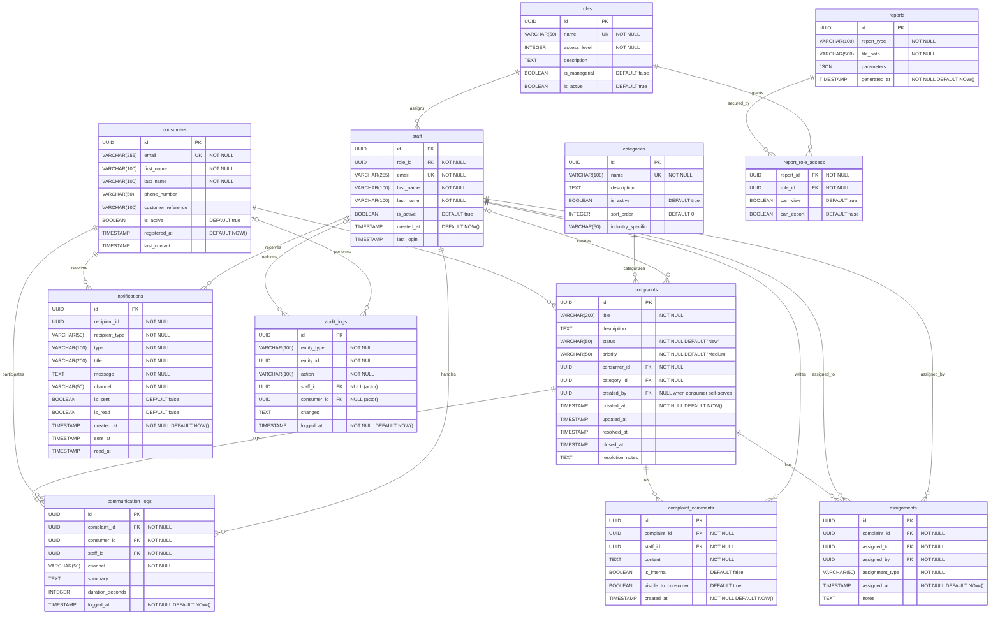
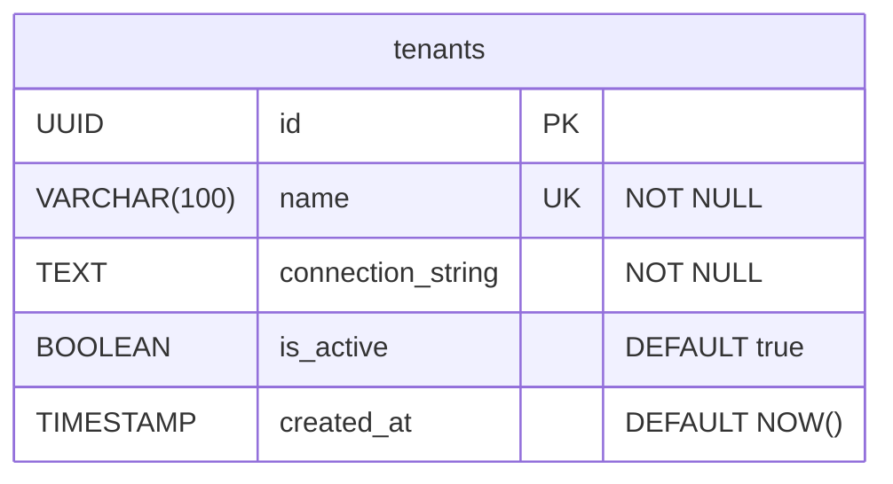

# Entity Relationship Diagrams

## Tenant database (one per tenant, identical schema)

```mermaid
erDiagram
    direction TB

    consumers {
        UUID id PK
        VARCHAR(255) email UK "NOT NULL"
        VARCHAR(100) first_name "NOT NULL"
        VARCHAR(100) last_name "NOT NULL"
        VARCHAR(50) phone_number
        VARCHAR(100) customer_reference
        BOOLEAN is_active "DEFAULT true"
        TIMESTAMP registered_at "DEFAULT NOW()"
        TIMESTAMP last_contact
    }

    roles {
        UUID id PK
        VARCHAR(50) name UK "NOT NULL"
        INTEGER access_level "NOT NULL"
        TEXT description
        BOOLEAN is_managerial "DEFAULT false"
        BOOLEAN is_active "DEFAULT true"
    }

    staff {
        UUID id PK
        UUID role_id FK "NOT NULL"
        VARCHAR(255) email UK "NOT NULL"
        VARCHAR(100) first_name "NOT NULL"
        VARCHAR(100) last_name "NOT NULL"
        BOOLEAN is_active "DEFAULT true"
        TIMESTAMP created_at "DEFAULT NOW()"
        TIMESTAMP last_login
    }

    categories {
        UUID id PK
        VARCHAR(100) name UK "NOT NULL"
        TEXT description
        BOOLEAN is_active "DEFAULT true"
        INTEGER sort_order "DEFAULT 0"
        VARCHAR(50) industry_specific
    }

    complaints {
        UUID id PK
        VARCHAR(200) title "NOT NULL"
        TEXT description
        VARCHAR(50) status "NOT NULL DEFAULT 'New'"
        VARCHAR(50) priority "NOT NULL DEFAULT 'Medium'"
        UUID consumer_id FK "NOT NULL"
        UUID category_id FK "NOT NULL"
        UUID created_by FK "NULL when consumer self-serves"
        TIMESTAMP created_at "NOT NULL DEFAULT NOW()"
        TIMESTAMP updated_at
        TIMESTAMP resolved_at
        TIMESTAMP closed_at
        TEXT resolution_notes
    }

    assignments {
        UUID id PK
        UUID complaint_id FK "NOT NULL"
        UUID assigned_to FK "NOT NULL"
        UUID assigned_by FK "NOT NULL"
        VARCHAR(50) assignment_type "NOT NULL"
        TIMESTAMP assigned_at "NOT NULL DEFAULT NOW()"
        TEXT notes
    }

    complaint_comments {
        UUID id PK
        UUID complaint_id FK "NOT NULL"
        UUID staff_id FK "NOT NULL"
        TEXT content "NOT NULL"
        BOOLEAN is_internal "DEFAULT false"
        BOOLEAN visible_to_consumer "DEFAULT true"
        TIMESTAMP created_at "NOT NULL DEFAULT NOW()"
    }

    communication_logs {
        UUID id PK
        UUID complaint_id FK "NOT NULL"
        UUID consumer_id FK "NOT NULL"
        UUID staff_id FK "NOT NULL"
        VARCHAR(50) channel "NOT NULL"
        TEXT summary
        INTEGER duration_seconds
        TIMESTAMP logged_at "NOT NULL DEFAULT NOW()"
    }

    notifications {
        UUID id PK
        UUID recipient_id "NOT NULL"
        VARCHAR(50) recipient_type "NOT NULL"
        VARCHAR(100) type "NOT NULL"
        VARCHAR(200) title "NOT NULL"
        TEXT message "NOT NULL"
        VARCHAR(50) channel "NOT NULL"
        BOOLEAN is_sent "DEFAULT false"
        BOOLEAN is_read "DEFAULT false"
        TIMESTAMP created_at "NOT NULL DEFAULT NOW()"
        TIMESTAMP sent_at
        TIMESTAMP read_at
    }

    reports {
        UUID id PK
        VARCHAR(100) report_type "NOT NULL"
        VARCHAR(500) file_path "NOT NULL"
        JSON parameters
        TIMESTAMP generated_at "NOT NULL DEFAULT NOW()"
    }

    report_role_access {
        UUID report_id FK "NOT NULL"
        UUID role_id FK "NOT NULL"
        BOOLEAN can_view "DEFAULT true"
        BOOLEAN can_export "DEFAULT false"
    }

    audit_logs {
        UUID id PK
        VARCHAR(100) entity_type "NOT NULL"
        UUID entity_id "NOT NULL"
        VARCHAR(100) action "NOT NULL"
        UUID staff_id FK "NULL (actor)"
        UUID consumer_id FK "NULL (actor)"
        TEXT changes
        TIMESTAMP logged_at "NOT NULL DEFAULT NOW()"
    }

    consumers ||--o{ complaints : reports
    categories ||--o{ complaints : categorizes
    staff |o--o{ complaints : creates
    roles ||--o{ staff : assigns
    complaints ||--o{ assignments : has
    staff ||--o{ assignments : assigned_to
    staff ||--o{ assignments : assigned_by
    complaints ||--o{ complaint_comments : has
    staff ||--o{ complaint_comments : writes
    complaints ||--o{ communication_logs : logs
    consumers ||--o{ communication_logs : participates
    staff ||--o{ communication_logs : handles
    consumers ||--o{ notifications : receives
    staff ||--o{ notifications : receives
    reports ||--o{ report_role_access : secured_by
    roles ||--o{ report_role_access : grants
    staff |o--o{ audit_logs : performs
    consumers |o--o{ audit_logs : performs
```

## Master database

```mermaid
erDiagram
    tenants {
        UUID id PK
        VARCHAR(100) name UK "NOT NULL"
        TEXT connection_string "NOT NULL"
        BOOLEAN is_active "DEFAULT true"
        TIMESTAMP created_at "DEFAULT NOW()"
    }
```
